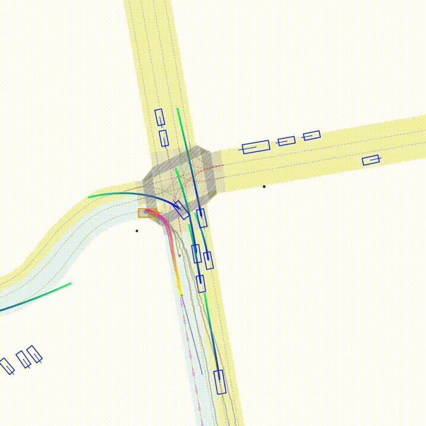
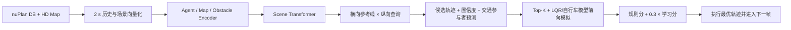

# PLUTO Planner Study：从公式到 nuPlan 最小闭环

一个面向学习者的 PLUTO 复现仓库：固定源码版本、下载 nuPlan mini 与预训练权重、在 Windows + CUDA 上跑通单场景闭环，并把模型、训练目标、后处理、自测和易错点串成一条可执行的学习路径。

> 本仓库不做完整训练，也不把单场景结果冒充论文复现。论文基准使用大规模训练集和多场景评测；这里的目标是“最小但完整、结果可检查”的闭环。



## 已验证结果

| 项目 | 本机结果 |
|---|---:|
| 场景 | `changing_lane_to_left` |
| 成功 / 失败 | 1 / 0 |
| nuPlan 闭环总分 | **0.94978375** |
| 专家路线进度 | 0.839308 |
| 无责任碰撞 / 可行驶区域 / 方向 / 舒适 / 限速 / TTC | 全部 1.0 |
| 单规划步耗时（均值 / 中位数） | 196.7 / 176.7 ms |
| 权重严格加载 | 438 张量，0 缺失，0 意外 |

原始摘要在 [`demo/outputs/mini_closed_loop_result.json`](demo/outputs/mini_closed_loop_result.json)，权重检查在 [`demo/outputs/checkpoint_validation.json`](demo/outputs/checkpoint_validation.json)。该结果仅覆盖一个由固定随机种子选出的 mini 场景，不能与论文 Val14 / Test14 分数直接比较。

## 最小完整闭环



1. 阅读 [`docs/01_method.md`](docs/01_method.md)：从输入表示一路推到 CIL 和混合评分。
2. 阅读 [`docs/02_reproduction.md`](docs/02_reproduction.md)：50 GB 方案、安装、下载、闭环和结果解释。
3. 阅读 [`docs/03_training.md`](docs/03_training.md)：虽不在本机完整训练，但理解缓存、损失、增强、DDP 和检查点兼容性。
4. 阅读 [`docs/04_pitfalls_and_self_test.md`](docs/04_pitfalls_and_self_test.md)：逐层排错和带答案自测。

## 一键路径（Windows PowerShell）

要求：NVIDIA GPU、CUDA 驱动、Conda、Git；建议至少 50 GB 可用空间。本次实测峰值约 **30.6 GiB**，保留 50 GB 是为了下载中断重试、日志和文件系统余量。

```powershell
powershell -ExecutionPolicy Bypass -File .\scripts\bootstrap.ps1
powershell -ExecutionPolicy Bypass -File .\scripts\download_artifacts.ps1
powershell -ExecutionPolicy Bypass -File .\scripts\self_test.ps1
powershell -ExecutionPolicy Bypass -File .\scripts\run_mini.ps1 -Render
```

脚本会把上游 PLUTO 和 nuPlan 固定到已验证提交，且在开始大文件下载前执行 50 GB 守卫。数据、权重和上游源码均被 `.gitignore` 排除；GitHub 仓库只发布原创教学、兼容代码、脚本和紧凑结果。

## 目录

```text
compat/                 Windows 兼容：纯 PyTorch NATTEN 0.14.6 接口、fcntl shim
demo/                   权重/数据/数值自测、结果汇总和紧凑可视化
docs/                   公式、复现、训练、易错点与自测
scripts/                环境、数据权重下载、单场景闭环、总自测
_deps/                  运行时克隆的固定版上游源码（不提交）
data/ checkpoints/      本地授权数据与权重（不提交）
```

## 版本与边界

- PLUTO：`b9964b649c660f1f4a971d614c66f5992e24c18a`
- nuPlan devkit v1.2：`ce3c323af01c0d7ec5672f7832ef53f9c679aab0`
- Python 3.9，PyTorch 2.0.1 + CUDA 11.8，PL 2.0.1
- Windows 没有 NATTEN 0.14.6 官方 wheel，因此提供参数名、窗口索引和前向定义兼容的纯 PyTorch实现；短历史序列足够快，但它不是通用 NATTEN 替代品。
- PLUTO 上游仓库在固定提交中没有许可证文件。本仓库不复制其源码，而由脚本克隆固定版本。数据、权重和上游代码的权利仍归各自权利人。

## 来源

- [PLUTO 官方代码](https://github.com/jchengai/pluto)
- [PLUTO 论文（arXiv:2404.14327）](https://arxiv.org/abs/2404.14327)
- [nuPlan devkit](https://github.com/motional/nuplan-devkit)
- [RIFT 权重镜像说明](https://github.com/CurryChen77/RIFT#data-and-ckpt)
- 结构参考：[lattice-planner-study](https://github.com/jcchen666888-cyber/lattice-planner-study)

本仓库原创代码和文档采用 [MIT License](LICENSE)。
