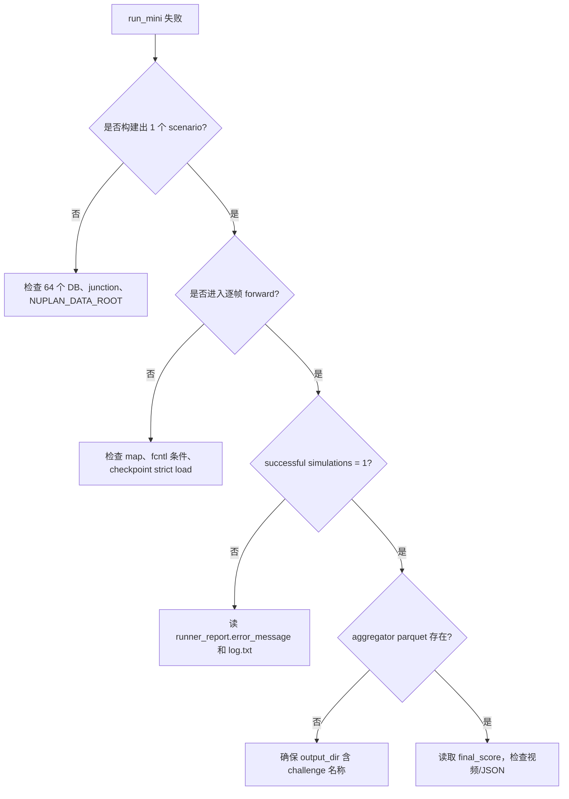

# 04｜易错点、排错树与详细自测

## A. 易错点清单

| 现象 | 根因 | 正确处理 |
|---|---|---|
| OneDrive 权重链接要求组织登录 | 原作者 HKUST 账户迁移，旧分享不再匿名直链 | 使用 RIFT README 公开镜像；再做哈希和 `strict=True` 结构验证 |
| 新 NATTEN 报 `unexpected ... attn.rpb` | 新版 API/state dict 改变；权重来自 0.14.6 | Linux 固定 0.14.6，Windows 使用本仓库短序列兼容层 |
| Windows 报 `No module named fcntl` | nuPlan 地图模块无条件导入 POSIX 锁 | 仅在已完整下载地图、sequential、只读条件下使用 shim |
| checkpoint 缺少/多出 hidden/ref-free/decoder 键 | training YAML 和 planner YAML 的三个 flag 不同 | 推理从 planner YAML 实例化；训练显式对齐 `use_hidden_proj/cat_x/ref_free_traj` |
| 手写构造模型后严格加载失败 | 类构造器默认 `num_heads=8,num_modes=6`，权重配置是 4 和 12 | 不依赖 Python 默认值，读取固定 YAML |
| 17 个指标有文件但聚合器说找不到 | 输出路径不含 challenge 名称 | 路径必须包含 `closed_loop_nonreactive_agents` |
| 模拟显示 finished，进程最后 `max() arg is empty` | 上一条导致 aggregator 为空，PLUTO 末尾仍尝试取最新文件 | 修输出路径后重跑；不要把它误诊为模型前向失败 |
| `candidate_trajectories` 为空 | 当前场景没有有效参考线 | 必须启用且加载 ref-free head；后处理要处理零候选 |
| `mask ... convert to bool` 警告刷屏 | PyTorch 2.0 的 attention 收到非 bool mask | 可在上游改成 bool 以优化；本次不影响数值 |
| 视频不生成 | 缺 `imageio-ffmpeg` / `imageio[pyav]`，或 `render=false` | 安装视频后端并传 `-Render` |
| 地图找不到 | ZIP 解压后在 `data/maps`，DB 在 `data/data/cache/mini`，与 v1.2 默认目录不同 | 下载脚本建立 `nuplan-v1.1/splits/mini` junction；检查环境变量 |
| 以为还要下载相机/激光数据 | 把 PLUTO 误当成传感器端到端感知模型 | 该复现以对象轨迹和 HD map 为规划输入，不需 sensor blobs |
| 论文“端到端”理解成 raw image → control | PLUTO 的 end-to-end 指从场景特征到规划损失可微 | 在博客中明确它是 planning E2E，不覆盖感知前端 |
| paper 的 93.57 与本地 0.9498 看似不一致 | 论文表格乘 100，且评测集合完全不同 | 先统一量纲，再区分多场景基准和单场景教学 |
| `feature_building_runtimes` 接近 0 | 上游计时器在真正构建特征前已经结束 | 不引用该字段；本教程报告包围整个规划步骤的 inference runtime |
| worker 报 0 GPU，模型却在 CUDA | nuPlan worker 资源统计与 planner 内部 `.to(cuda)` 是两套逻辑 | 用 `torch.cuda.is_available()`、显存变化和模型 device 验证 |
| 直接提交 `_deps` 到 GitHub | PLUTO 固定提交没有许可证，且数据/权重有独立条款 | `.gitignore` 排除，脚本克隆固定提交 |
| 用同一个输出目录反复跑 | 多个 aggregator parquet 使自动摘要无法唯一选择 | 每次使用唯一 `RunName` |
| CIL 开启后 OOM | 每个 batch 被扩为 origin/positive/negative 三份 | 先把原始 batch 降到约 1/3，再实测显存 |
| 验证 loss 降但闭环更差 | 离线模仿指标不含状态漂移和 tracker 执行误差 | 固定 token 闭环回归，按场景类型报告安全与进度 |

## B. 排错树



最先查看的证据不是终端最后一行，而是：

```text
runner_report.parquet: succeeded, error_message, duration
log.txt: successful/failed simulations, aggregator warning
aggregator_metric/*.parquet: final_score 行
demo/outputs/*validation.json: 数据、权重、NATTEN 自测
```

## C. 自动化验收

```powershell
powershell -ExecutionPolicy Bypass -File .\scripts\self_test.ps1
```

通过标准：

- 可用空间不少于 50 GB（首次准备时）；
- CUDA 前向和反向结果均有限，形状不变；
- NATTEN 左端、中间、右端窗口与相对偏置索引符合旧定义；
- 权重 SHA-256 相符，438 个张量严格加载，0 缺失/0 意外；
- 64 个 DB 和 4 个 GPKG 全部 SQLite quick check 为 `ok`；
- 闭环 `runner_report.succeeded=True`；
- aggregator 有且仅有一条 `final_score`；
- 紧凑 JSON 中 `status=pass`，所有数值有限且在合理区间。

注意：自动化测试能证明软件链路和文件一致性，不能证明模型对所有场景安全。

## D. 概念自测（先答，再展开答案）

### 1. PLUTO 的“端到端”从哪里到哪里？

<details><summary>答案</summary>

从对象历史、静态障碍、HD map、信号灯等结构化场景特征到规划/预测输出和可微训练损失；它不是本论文范围内的 raw camera/lidar 感知到控制。

</details>

### 2. 为什么最终轨迹不是置信度最大的候选？

<details><summary>答案</summary>

学习置信度可能违反碰撞、TTC、可行驶区域或动力学约束。候选先经 tracker/车辆模型 rollout 和规则评估，再最大化 $\pi^{rule}+0.3\pi^{learn}$。

</details>

### 3. 为什么参考线叫“半锚定”？

<details><summary>答案</summary>

横向 query 被道路拓扑参考线锚定，纵向 query 仍是可学习、anchor-free 的行为模式。它兼顾几何先验与数据驱动多样性。

</details>

### 4. 若 $N_R=6,N_L=12$，完整注意力和因子化注意力各有多少个 query 配对量级？

<details><summary>答案</summary>

完整为 $(6\times12)^2=5184$。因子化为 $12\times6^2+6\times12^2=432+864=1296$，约减少到四分之一；这里忽略 head 和通道常数。

</details>

### 5. 半径 120 m、12 个纵向模式时，真值终点沿线距离 37 m 匹配哪个模式？

<details><summary>答案</summary>

$\Delta s=120/12=10$ m，$\lfloor37/10\rfloor=3$，即从 0 计数的第 3 个模式（人类序号第 4 个）。

</details>

### 6. 为什么不能让所有候选都回归同一真值？

<details><summary>答案</summary>

那会把不同 query 的梯度都拉向同一轨迹，造成模式坍缩。教师强制只给匹配模式回归监督，并用分类分数学习哪个模式应被选择。

</details>

### 7. smooth L1 在误差 0.2 和 3.0 时各是多少（阈值 1）？

<details><summary>答案</summary>

$0.5\times0.2^2=0.02$；$3-0.5=2.5$。小误差二次、大误差线性。

</details>

### 8. CIL 损失为何能拉近正样本、推远负样本？

<details><summary>答案</summary>

$\mathcal L_c=\operatorname{softplus}((s^- - s^+)/\sigma)$。对 $s^+$ 的导数为负，对 $s^-$ 的导数为正；梯度下降因此增大 $s^+$、减小 $s^-$。

</details>

### 9. 为什么负增强不使用原始轨迹做模仿监督？

<details><summary>答案</summary>

插入前车、删除交互车或反转信号灯已改变因果结构，原轨迹可能碰撞或违规。它只提供“表示应该不同”的对比信号。

</details>

### 10. ESDF 双线性查询比逐点可微栅格化节省什么？

<details><summary>答案</summary>

每个圆心只查询相邻四个像素，无需为每个候选、每个时间点生成整张轨迹图；内存和计算从与整幅栅格面积相关，降为与候选点数相关。

</details>

### 11. 为什么先用车辆模型 rollout 再评估？

<details><summary>答案</summary>

网络轨迹不一定能被有限转角/加速度的控制器精确执行。评估 rollout 能把 tracker 与动力学误差纳入选择，缩小计划与执行的差异。

</details>

### 12. 本地单场景分数 0.9498 能否证明复现论文 93.57？

<details><summary>答案</summary>

不能。除百分制显示不同外，论文是大规模训练与多场景集合统计；本地只证明一条固定 mini 闭环链路可运行。

</details>

## E. 工程自测

### 13. 只检查 checkpoint 文件名为什么不够？

<details><summary>答案</summary>

镜像可能放错变体、下载可能截断、同名文件可能被替换。至少检查字节数、SHA-256、顶层 Lightning 结构、tensor 数与严格加载。

</details>

### 14. `strict=False` 能不能解决结构不匹配？

<details><summary>答案</summary>

它只能隐藏问题，不能让缺失 head 获得正确参数。教学复现先用 `strict=True`；只有明确知道哪些层要重新初始化的微调实验才可有记录地放宽。

</details>

### 15. 为什么要给源码固定 commit，而不只写仓库 URL？

<details><summary>答案</summary>

分支会移动，配置、依赖和默认值会改变。固定 commit 才能把“代码 + 权重 + 文档结论”绑定到同一实现。

</details>

### 16. 数据 ZIP 哈希通过后，还需要 SQLite quick check 吗？

<details><summary>答案</summary>

需要。哈希验证压缩包的一致性；quick check 验证解压后的数据库页、索引结构可读。两者覆盖的故障阶段不同。

</details>

### 17. 为什么 50 GB 守卫大于 30.6 GiB 实测峰值？

<details><summary>答案</summary>

为断点续传、失败解压、日志/视频、不同环境求解结果和 GB/GiB 差异留余量。空间计划应按峰值而非最终文件大小。

</details>

### 18. Windows `fcntl` shim 什么时候不安全？

<details><summary>答案</summary>

当多个进程可能同时下载或写同一地图层时。no-op 锁不提供互斥；此时应改在 Linux/WSL 使用真实 `flock`，或实现可靠的 Windows 文件锁。

</details>

### 19. CIL 原 batch 8，编码器实际处理多少场景？

<details><summary>答案</summary>

24：8 个原样本、8 个正增强、8 个负增强。轨迹监督通常作用于前 16 个，对比监督作用于三元组。

</details>

### 20. 如何设计比单场景更可信但仍小规模的评测？

<details><summary>答案</summary>

预先固定跨类型 token 列表和随机种子；同时报告样本数、成功/失败、均值、中位数、低分位数、二值安全项和每类结果；不要在看过分数后挑场景。

</details>

## F. 动手题

1. 把 `learning_based_score_weight` 从 0.3 改为 0、0.1、1.0，对同一组固定 token 比较，而不是只跑一个样本。
2. 在不改变权重的前提下，把 attention mask 改为 bool，验证分数与轨迹哈希是否保持一致，并比较耗时。
3. 统计每帧 Top-20 候选中规则分为 0 的比例，观察它与路口复杂度的关系。
4. 用常速度预测替代 learned prediction，复现论文消融的方向性结论；不要预设数值完全相同。
5. 为纯 PyTorch NATTEN 增加 dilation、短于窗口 padding 和 CPU/GPU 一致性测试。

完成标准不是“脚本没报错”，而是你能解释每个改变通过哪条因果链影响候选、规则分和闭环结果。
